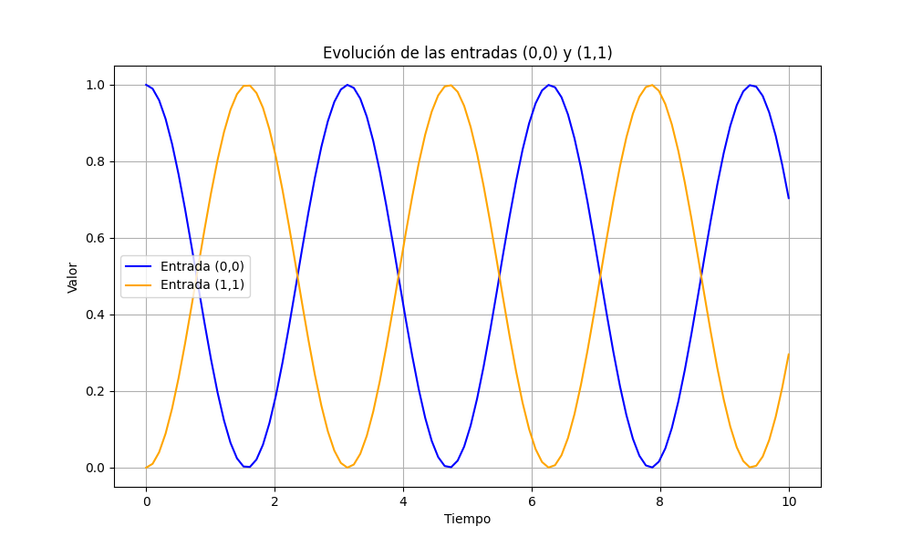

# Referencia

Esta pagina de referencia contiene la documentacion de las funciones. Es generada de forma automatica con los docstrings
que contiene el modulo. Los docstrings contienen ejemplos de uso. Importante: notar que la implementacion solo depende de dos funciones: dyn generator() y rk4(). Estas son las funciones que se documentan e incluyen en esta referencia. La parte que realiza el calculo (el for loop que evalua la dinamica temporal) es la parte que genera un/a usuario/a. Esa parte se evalua y se detalla como parte de un tutorial. Se escribieron las funciones y se documento su uso, argumentos esperados y resultados de salida. 

::: sum.sum

